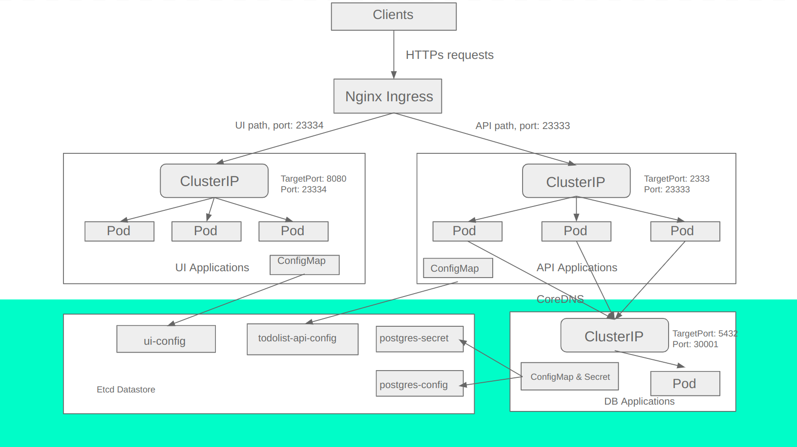
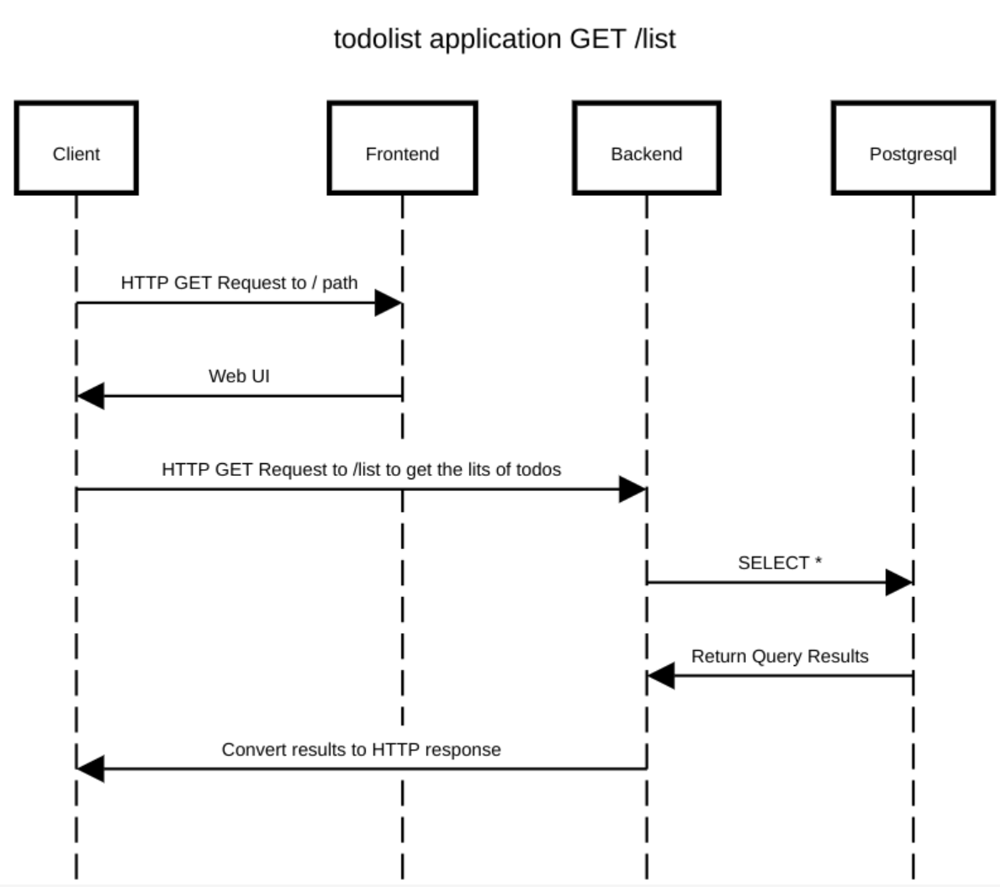

# ContainerCraft-22
Hands-on practices for containerizing software systems

#### K8s Architecture and Components

####  Sequence Diagram for GET Requests

####  Sequence Diagram for POST Requests


#### Rebuild and Push images to docker registry
##### Example
```
sudo docker build -t yanghoo/todolist-backend:<tag>
sudo docker push yanghoo/todolist-backend:<tag>
```

## Helm Charts

#### Generating the charts 
```
helm create [CHART_NAME] 
```

#### Installing with the Chart
```
helm install [RELEASE_NAME] [CHART_PATH] 
```
#### Uninstall
```
helm uninstall [RELEASE_NAME]
```
#### Upgrade
```
helm upgrade [RELEASE_NAME] [CHART] --set [SUBCHART_NAME].[KEY]=[VALUE]
```
##### Example:
```
polymagicyang@cloudshell:~/ContainerCraft-22/charts-todolist (todolist-20001224)$ helm upgrade todolist ./ --set frontend.image.tag=v1.0.4
Release "todolist" has been upgraded. Happy Helming!
NAME: todolist
LAST DEPLOYED: Sun Jan 28 18:35:19 2024
NAMESPACE: default
STATUS: deployed
REVISION: 2
```

## Deploy applications on GKE at the first time.
#### 1. Connect to the GKE via Google cloud console
```
gcloud container clusters get-credentials todolist-cluster-yanghoo --region europe-central2 --project dev-trees-407820
```

#### 2. Install coredns on GKE.
```
helm repo add coredns https://coredns.github.io/helm
helm --namespace=kube-system install coredns coredns/coredns
```

#### 3. Install cert-manager
```
helm repo add jetstack https://charts.jetstack.io

helm repo update

kubectl apply -f https://github.com/cert-manager/cert-manager/releases/download/v1.13.3/cert-manager.crds.yaml

helm install \
  cert-manager jetstack/cert-manager \
  --namespace cert-manager \
  --create-namespace \
  --version v1.13.3
```

#### 4. Pull the Git repository
```
git clone https://github.com/PolymagicYang/ContainerCraft-22.git
```

#### 5. Install Nginx Ingress Application
Follow this article: [Using the GCP Marketplace NGINX Ingress Controller Image](https://docs.nginx.com/nginx-ingress-controller/installation/nic-images/using-gcp-marketplace-package/)
We use nginx annotations to enable force-https-redirect.

#### 6. Install applications by applying helm charts
```
helm install todolist-app ./todolist-charts
```

#### 7. Bind External IP Address to Domain Name
I use www.yanghoo.online as our domain name, because Yang is part of my name (Zhiyang), you can buy your own domain name via namecheap, and bind it via dashboard.

## RBAC
In this section, I follow this article [Creating a Kubernetes RBAC user in Google Kubernetes Engine (GKE)](https://medium.com/@mattgillard/creating-a-kubernetes-rbac-user-in-google-kubernetes-engine-gke-fa930217a052) to setup the users: 1. Intern 2. Admin 3. Guest.
I've outlined three distinct RBAC roles tailored for different users:
1. Internship Student
   - This role is designed specifically for internship students, granting them permissions to read, create, and update particular resources within a designated namespace, allowing them to contribute to specific projects effectively.
2. Administrator
   - Administrators are granted the capability to read and update secrets along with other sensitive information, ensuring they can manage and protect critical data.
3. Guest
   - Guests are assigned a read-only role, restricting them from modifying any resources, thus ensuring data integrity while allowing information access.
- You can see the details in ./charts-todolist/templates

## Network Policies
##### I have 4 network policies:
1. Deny-all policy: This policy will block all incoming connections.
2. Isolate-db: specifies a Kubernetes NetworkPolicy named "isolate-db" to control network traffic for pods labeled as "postgres," allowing only egress to and ingress from pods labeled as "todolist-api." 
3. Isolate-ui: creates a Kubernetes NetworkPolicy named "isolate-ui" to manage ingress for "todolist-ui" pods, allowing connections only from "todolist-api" pods, a specific VPN network, and public HTTPS access on ports 443 and 80. 
4. Isolate-api: defines a Kubernetes NetworkPolicy named "isolate-api" to restrict ingress to the "todolist-api" pods, allowing access only from the "todolist-ui" pods, any external HTTPS traffic, and a "postgres" pod, while also permitting DNS resolution on port 53 for both TCP and UDP protocols.
- You can see the details in ./charts-todolist/templates

## Cert-manager & OpenSSL 
In this segment, we employ OpenSSL to create the root certificate, acting as the Certificate Authority (CA). This allows us to install the root certificate on our local computer, enabling a genuine HTTPS connection.
1. Generate the ec key.
```
openssl ecparam -name prime256v1 -genkey -noout -out key.pem
```
2. Create the root certificate. (Don't foget to add the -extensions)
```
openssl req -new -x509 -out cluster-cert.crt -days 3650 -config ./ca.conf -key key.pem -extensions v3_ca 
```
3. Get the base64 of cert.
```
cat cluster-cert.crt | base64 -w0
```
4. Create the ClusterIssuer with the generated certificate & key 
```
data:
  tls.crt: [TLS_CRT]
  tls.key: [TLS_KEY]
```
5. Place all necessary files into the Helm charts templates directory; executing the Helm chart installation will deploy the issuer. 
6. Configure the ingress so that it can send the csr to issuer
```
apiVersion: networking.k8s.io/v1
kind: Ingress
metadata:
  annotations:
    # add an annotation indicating the issuer to use.
    cert-manager.io/cluster-issuer: ca-issuer 
    cert-manager.io/common-name: Zhiyang Wang
    cert-manager.io/email-sans: ywa227@student.vu.nl
    cert-manager.io/subject-organizations: VU Amsterdam
    cert-manager.io/subject-organizationalunits: Faculty of Science
    # make sure to redirect every http connections to https connections.i
    nginx.ingress.kubernetes.io/force-ssl-redirect: "true"
    nginx.ingress.kubernetes.io/ssl-passthrough: "true"
    nginx.ingress.kubernetes.io/use-regex: "true"
  name: api-ingress 
spec:

  ...

tls: # < placing a host in the TLS config will determine what ends up in the cert's subjectAltNames
  - hosts:
    - www.yanghoo.online
    secretName: api-certs
```
These two lines force the https connection.
- nginx.ingress.kubernetes.io/force-ssl-redirect: "true" 
- nginx.ingress.kubernetes.io/ssl-passthrough: "true"*

## Update Applications
#### Rolling upgrade
To enable the rolling upgrade, we can change the template part of the yaml file.
we also can use the kubectl cmd:
```
kubectl set image deployment/<deployment-name> <container-name>=<new-image>:<tag>
```


#### Canary upgrade:
1. Establish a service, ensuring it uses the deployment's selector labels for pod selection.
```
apiVersion: v1
kind: Service
metadata:
  name: ui-service 
  labels:
    {{- include "frontend.labels" . | nindent 4 }}
spec:
  type: {{ .Values.service.type }}
  ports:
    - port: {{ .Values.service.port }}
      targetPort: http
      protocol: TCP
      name: http
  selector:
    app: todolist-ui
```
2. Draft a new YAML file, incorporating the same pod selector labels but with updated versions. The number of replicas should be fewer than what's currently active. Utilize the 'eq' control operator of helm charts to determine execution.
```
{{ if eq .Values.deployNew.enable false }}
apiVersion: apps/v1
kind: Deployment
metadata:
  name: todolist-ui-v2
  labels:
    app: todolist-ui
spec:
  {{- if not .Values.autoscaling.enabled }}
  replicas: {{ .Values.NewReplicaCount }}
  {{- end }}
  selector:
    matchLabels:
      app: todolist-ui
      version: v2
  template:
    metadata:
      {{- with .Values.podAnnotations }}
      annotations:
        {{- toYaml . | nindent 8 }}
      {{- end }}
      labels:
        app: todolist-ui
        version: v2
    spec:
      {{- with .Values.imagePullSecrets }}
      imagePullSecrets:
        {{- toYaml . | nindent 8 }}
      {{- end }}
      serviceAccountName: {{ include "frontend.serviceAccountName" . }}
      securityContext:
        {{- toYaml .Values.podSecurityContext | nindent 8 }}
      containers:
        - name: {{ .Chart.Name }}
          securityContext:
            {{- toYaml .Values.securityContext | nindent 12 }}
          image: "{{ .Values.image.repository }}:v1.0.7"
          imagePullPolicy: {{ .Values.image.pullPolicy }}
          ports:
            - name: http
              containerPort: 80
          resources:
            {{- toYaml .Values.resources | nindent 12 }}
          env:
          - name: VERSION
            value: v2
{{ end }}
```
3. Deploy the updated version of the application by executing a helm upgrade.
```
helm upgrade todolist-app ./ --set deployNew.enalble=true
```
4. Once the new version has been thoroughly tested and verified, remove all deployments of the old version using kubectl delete.
```
kubectl delete deployment <name-of-the-old-deployment>
```
5. Adjust the scale of the new version's application deployments to the required quantity with kubectl scale.
```
kubectl scale deployment <deployment-name> --replicas=<number-of-replicas>
```